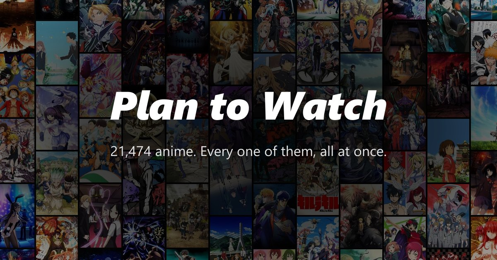

# Plan to Watch

Your plan-to-watch list was never going to get shorter. Here is all of it at once.

**[plan-to-watch.pages.dev](https://plan-to-watch.pages.dev)** - an interactive WebGL wall of **21,474 anime series and films**, rendered as a force-directed voronoi diagram of poster art.

[](https://plan-to-watch.pages.dev)

An anime fork of [gnovotny/nothing-to-watch](https://github.com/gnovotny/nothing-to-watch), which does the same thing for films. The engine and the interface are theirs; this fork replaces the data, adds the pipeline that builds it, and swaps in anime-specific details, links and credits.

## What is in the wall

| Rule | Detail |
|---|---|
| Types | TV, movies, OVA, ONA, plus specials that stand on their own |
| Excluded | Hentai only |
| Included on purpose | Ecchi, Chinese and Korean animation, and every sequel as its own entry |
| Order | Each franchise's most popular entry first, by MyAnimeList member count, spiralling out from the centre; sequels, films and OVAs fill the outer rings |
| Titles | English where one exists, romaji otherwise, with the other spellings underneath |
| Details | Year, genres, score, synopsis, and links to MyAnimeList, AniList and Kitsu |

## Marking your own list

Enter a public MyAnimeList username (the checklist icon, top right) and every
title on that profile is marked on the wall with a lit rim around the cell:
amber for completed, blue for watching, lime for on hold, red for dropped,
violet for plan to watch. A switch fades everything else so only your list
stays lit. Titles beyond the wall size you picked are counted separately, so
the panel tells you when raising it would show more.

The username lives in your browser only. The lookup runs through
`functions/api/mal-list.js`, a small Cloudflare Function, because MyAnimeList's
API sends no CORS headers and so cannot be called from a page directly. It is
the only server-side code on the site, and `public/_routes.json` keeps it off
every other request. `public/json/mal-index.json` maps MAL ids to wall
positions; the shader reads a status byte per cell.

## How it works

- **Engine** - the voronoi seeds come from a grid-constrained force simulation running across web workers on `SharedArrayBuffer`, drawn with WebGL2 (OGL and GLSL). That is why the site needs cross-origin isolation headers (`public/_headers`).
- **Textures** - posters are packed into compressed atlases at three zoom levels (DXT1 for desktop GPUs, ETC for phones), and the focused cell swaps in a full-resolution poster.
- **Poster sheets** - full-size posters are packed 9x6 into 398 sheets instead of 21,472 files, which keeps the whole site (~790 MB, 735 files) under Cloudflare Pages' free-plan file limit. The detail panel crops its poster out of the same sheet.
- **No backend** - every title, synopsis and poster is baked into static files at build time. The live site never calls MyAnimeList or Kitsu.

## Data sources

- **[Kitsu](https://kitsu.app)** - titles, synopses, posters, ratings, popularity, franchise links. No API key needed.
- **[MyAnimeList](https://myanimelist.net)** - member counts for ordering, plus synopses and English titles for the ~4.3k titles Kitsu has not mapped. Needs a free client ID.
- **[manami-project/anime-offline-database](https://github.com/manami-project/anime-offline-database)** - the catalogue backbone and cross-provider ID mapping.

AniList is deliberately **not** used: its terms forbid mass collection of media data, which is exactly what building a static dataset is. The site still links to AniList pages.

## Running locally

Needs Node 20+, [pnpm](https://pnpm.io) and a browser with WebGL2.

```bash
git clone https://github.com/art3mes/plan-to-watch.git
cd plan-to-watch
pnpm install
cp .env.local.example .env.local
pnpm dev                # http://localhost:3000
```

To exercise the list lookup locally, put the same `MAL_CLIENT_ID` line in a
`.dev.vars` file (gitignored) and run `pnpm dev:api` alongside `pnpm dev`.

A fresh clone includes a **sample**: the 216 most popular titles, one atlas page per zoom level and four poster sheets, repeated across the wall. The full 21,474-title data is generated, not committed - build it as below.

| Command | Description |
|---|---|
| `pnpm dev` | Dev server on port 3000 |
| `pnpm dev:api` | Runs the MAL relay locally on port 8788 (port 3000 forwards `/api` to it) |
| `pnpm build` | Typecheck and production build |
| `pnpm run test` | Unit tests (Vitest) |
| `pnpm test:e2e` | End-to-end tests (Playwright) |
| `pnpm check` | Biome lint and format |
| `pnpm run deploy` | Build and upload to Cloudflare Pages |

On Windows with `core.autocrlf=true` the checkout has CRLF line endings while Biome expects LF, so `pnpm check` reports formatting differences on untouched files; `pnpm biome lint <files>` is the useful signal.

## Building the full data

Put `MAL_CLIENT_ID` in `.env.local` - register an app at [myanimelist.net/apiconfig](https://myanimelist.net/apiconfig) as `other` / non-commercial. The first step also needs `data/raw/anime-offline-database-minified.json` from the [dataset releases](https://github.com/manami-project/anime-offline-database/releases).

```bash
pnpm anime:catalog      # manami dump -> data/build/catalog.json     (instant)
pnpm anime:kitsu        # Kitsu crawl, 20 titles per request         (~30 min)
pnpm anime:popularity   # MAL popularity ranking, 500 per request    (~1 min)
pnpm anime:mal          # MAL details for titles Kitsu lacks         (~1-2 h)
pnpm anime:order        # merge, group franchises, order, cut chunks (instant)
pnpm anime:posters      # download one poster per title              (~20 min, ~1 GB)
pnpm anime:atlases      # pack atlases and poster sheets             (~5 min)
pnpm anime:index        # MAL id -> wall position lookup           (instant)
pnpm anime:check        # title data and textures agree
```

Then set the `VITE_MEDIA_VERSION_*_LAYERS` counts that `anime:atlases` prints in `.env.local`, and restart `pnpm dev`.

Every crawl is resumable - rerun after an interruption and it continues. Poster files are keyed by provider ID, not by wall position, so re-ordering the wall never re-downloads anything.

### Texture encoding

The engine wants DXT1 inside DDS for desktop GPUs and ETC inside KTX for phones. `texture-compressor` only shells out to binaries that are not available here, so `scripts/anime/encode.mjs` implements both formats directly - about 400 lines, no native dependencies. The ETC selector bit order was recovered empirically by decoding upstream's own `low/ktx/0.ktx` against its `low/dds/0.dds` twin.

## Deploying

Cloudflare Pages' free plan, uploaded from the machine that built the data.
Everything is a static file except `functions/api/mal-list.js`, which only runs
when someone looks up a username:

```bash
pnpm wrangler login     # once - browser sign-in
pnpm wrangler pages secret put MAL_CLIENT_ID --project-name=plan-to-watch
pnpm run deploy         # build, check the file count, upload
```

The secret is the MyAnimeList client id the relay uses; without it the list
lookup answers "not configured" and the rest of the site is unaffected. For
local runs `pnpm dev:api` reads the same id from `.dev.vars`.

Deploy from your machine rather than a git-triggered build: the generated media is not in the repository, so a build on Cloudflare or Netlify would produce a wall without posters. Later deploys upload only changed files. Details and the post-deploy checklist are in [docs/deploy.md](docs/deploy.md).

## Licence

Full third-party terms are in [NOTICE.md](NOTICE.md).

- **Code** - MIT, inherited from the upstream project; the original copyright notice stays.
- **WebGL fragment shaders** - Creative Commons BY-NC-SA 3.0, so the project is **non-commercial only**.
- **Anime data** - anime-offline-database under ODbL v1.0 (the served title data is a derived database, shared under the same terms); MyAnimeList under its API licence, non-commercial; Kitsu credited as a source.
- **Poster art** - property of the respective studios and licensors, shown for identification only.

To request removal of any material, [open an issue](https://github.com/art3mes/plan-to-watch/issues).

## Credits

Engine and interface by [gnovotny](https://github.com/gnovotny) ([nothing-to-watch](https://github.com/gnovotny/nothing-to-watch)). Data from [Kitsu](https://kitsu.app), [MyAnimeList](https://myanimelist.net) and [manami-project](https://github.com/manami-project/anime-offline-database).
